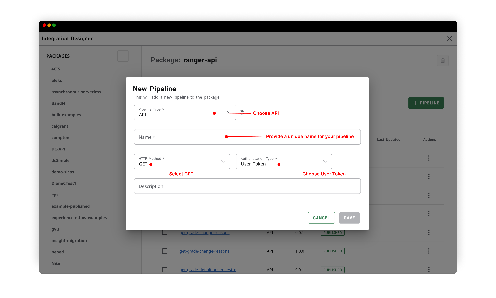
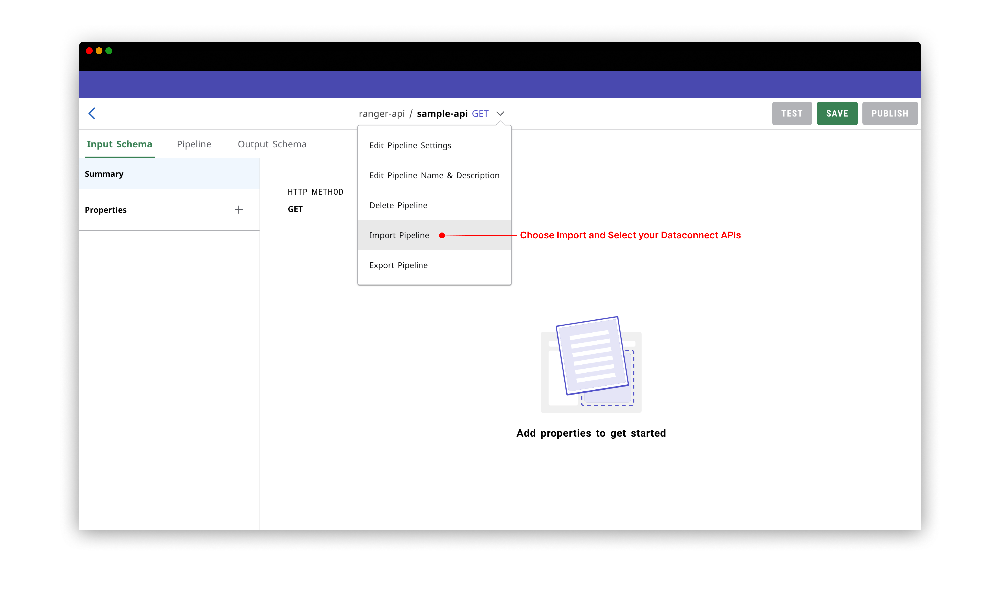
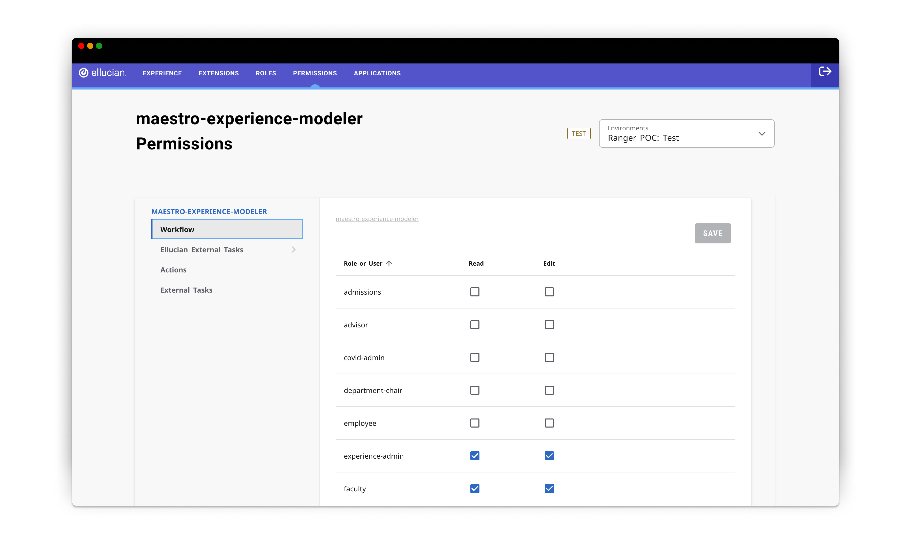
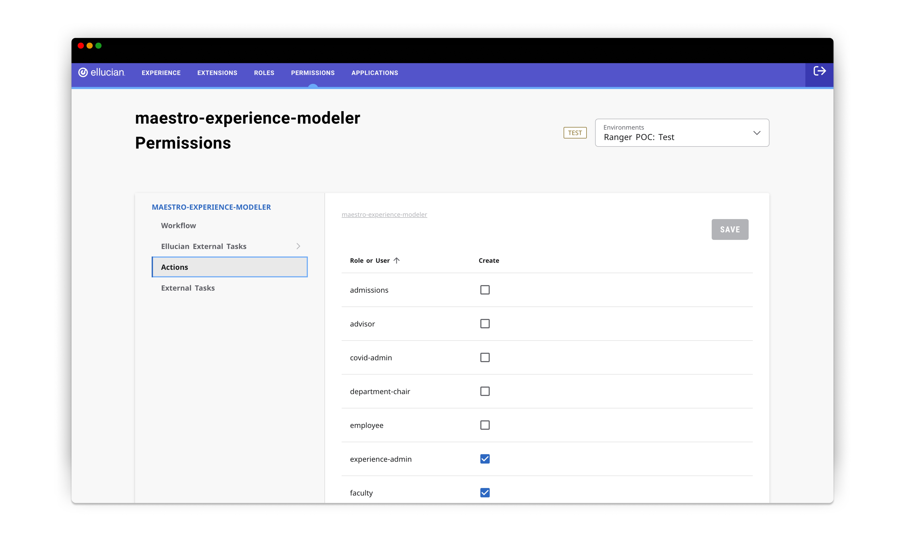
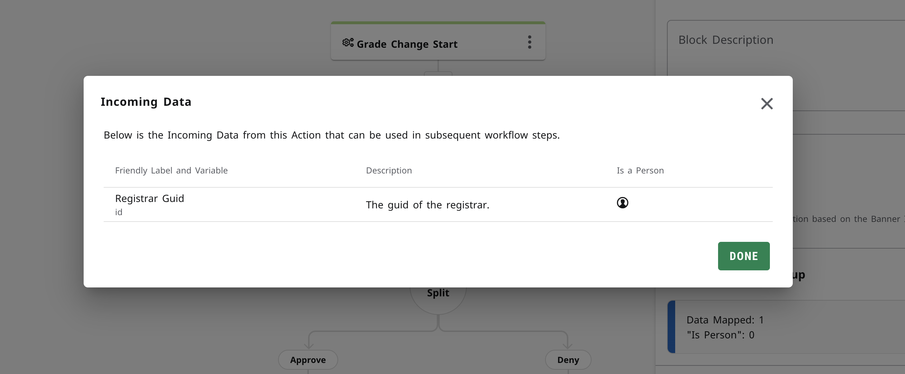
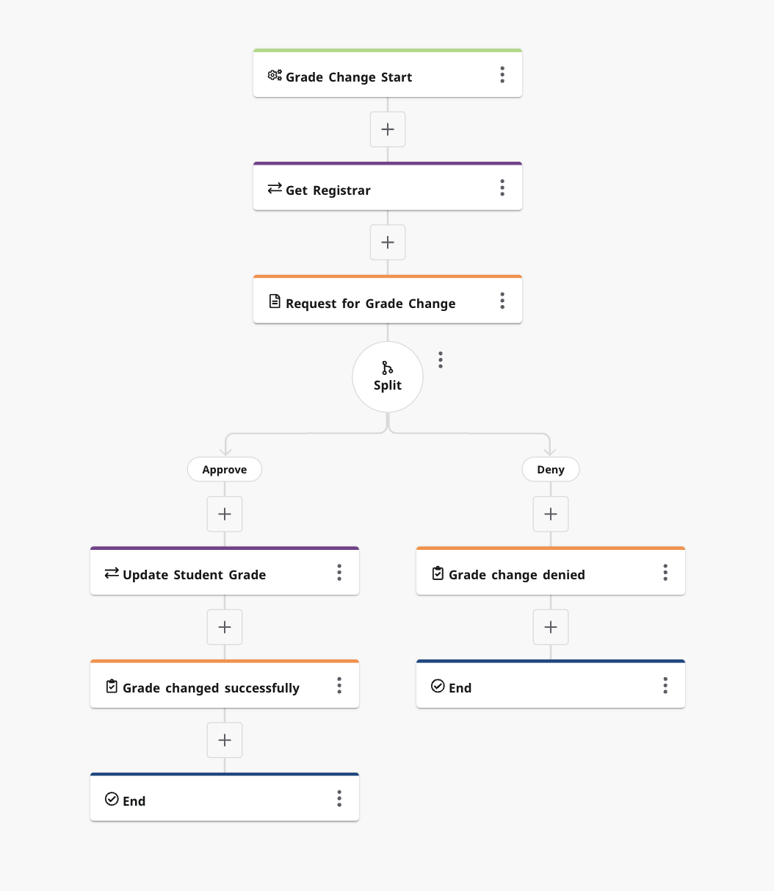
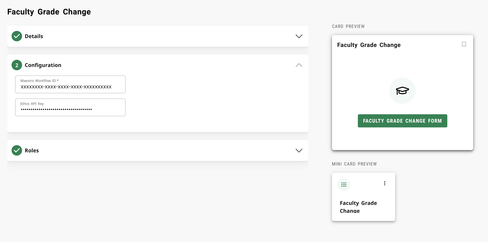
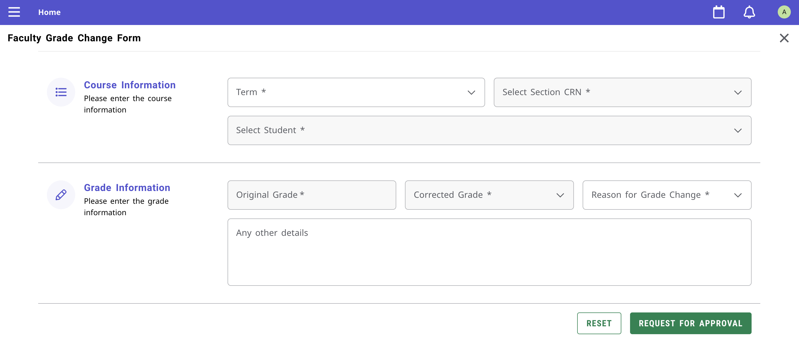

# Experience Faculty Grade Change - Intelligent Processes Workflow

This extension facilitates a streamlined process for faculty members to formally request the registrar's intervention in grade adjustments for individual students.

## Table of Contents
- DataConnect Serverless APIs
  - For Experience Extension
  - For Intelligent Processes Actions
- Intelligent Processes Workflow & Actions
- Experience Card

## Users

For this POC, we'll be using two type of users.

| Role | Description  |
|:----------|:----------|
|  Faculty | The Faculty would login to the Experience to use the card |
| Registrar | The Registrar Banner ID would be set in the Intelligent Processes Action block. This would inturn set the Registrar ID by calling the persons API and they would be one receiving the request for approval task |

# DataConnect Serverless APIs
## For Experience Extension

For this POC we require the utilization of EEDM APIs. Below are the list of all the APIs we need to create as DataConnect Serverless APIs for the experience extension to consume.

| API | API Type | Intelligent Processes API Name |
|:-----|:--------|:-----------------|
|[academic-periods](https://resources.elluciancloud.com/bundle/banner_api_ethos_api_academic_periods_16.1.0/page/academic-periods.html) | EEDM | [get-academic-periods-eip-workflow](./dataconnect/get-academic-periods-eip-workflow.json) |
| [grade-definitions](https://resources.elluciancloud.com/bundle/banner_api_ethos_api_grade_definitions_6.0.0/page/grade-definitions.html) | EEDM | [get-grade-definitions-eip-workflow](./dataconnect/get-grade-definitions-eip-workflow.json) |
| [sections](https://resources.elluciancloud.com/bundle/banner_api_ethos_api_sections_16.1.0/page/sections.html) | EEDM | [get-sections-eip-workflow](./dataconnect/get-sections-eip-workflow.json)|
| [persons](https://resources.elluciancloud.com/bundle/banner_api_ethos_api_persons_12.6.0/page/persons.html) | EEDM | [get-persons-eip-workflow](./dataconnect/get-persons-eip-workflow.json)|
| [section-registrations](https://resources.elluciancloud.com/bundle/banner_api_erp_api_section_registrations_1.0.0/page/section-registrations.html) | EEDM | [get-section-registrations-eip-workflow](./dataconnect/get-section-registrations-eip-workflow.json)|
| [grade-change-reasons](https://resources.elluciancloud.com/bundle/banner_api_ethos_api_grade_change_reasons_6.0.0/page/grade-change-reasons.html) | EEDM | [get-grade-change-reasons-eip-workflow](./dataconnect/get-grade-change-reasons-eip-workflow.json) |
| [student-transcript-grades](https://resources.elluciancloud.com/bundle/banner_api_ethos_api_student_transcript_grades_1.1.0/page/student-transcript-grades.html) | EEDM | [get-student-transcript-grades-eip-workflow](./dataconnect/get-student-transcript-grades-eip-workflow.json) |

All the above mentioned DataConnect Pipelines can be found at : https://github.com/ellucian-developer/experience-intelligent-processes-grade-change/tree/main/dataconnect

Dataconnect Serverless APIs pipelines mentioned above are by default configured on the `.env` file. 

Now let us see how to create these DataConnect Serverless APIs on Integration Designer

##### Step 1: Access the Integration Designer Card 
- Log in to your Experience account. 
- From the Experience dashboard, locate and click on the "Integration Designer" card. 
- Note you will need to setup DataConnect to see the integration designer card find [the documentation here](https://resources.elluciancloud.com/bundle/ethos_data_connect_int_design_acn_use/page/c_dc_designer_accessing_designer.html)
- In the card menu, select "View Details."

##### Step 2: Creating the DataConnect Serverless APIs

- Create a package. Give a name and description. (Note: The package name must be globally unique).
- Locate the "Add Pipeline" button. <p align="center">

</p>

- In the "Pipeline type" dropdown, select "API."
- Provide a unique name for your pipeline (Note: The pipeline name must be globally unique). 
- Select the get http Method
- Choose the `User Token` as authentication type in the drop down.
- You can add an optional description for your pipeline.
- Save your pipeline.
- At the middle top Next to your pipeline's name, use the dropdown menu and click "Import Pipeline." 
- A file explorer window will pop up; here, please find and select your pipeline file in JSON format.

##### Step 3: Publish the Pipeline 

- Once all the configuration has been finished for the pipeline, click on the “Publish” button located at the top right of the site. 

Similarily follow the same process and create all the remaining APIs under the same package you have created on **Step 2**

##### Step 4: Permissions
- Follow the steps mentioned on https://resources.elluciancloud.com/bundle/ethos_data_connect_int_design_acn_use/page/t_dc_designer_user_token_configuration.html for granting permissions for the DataConnect Serverless APIs

<hr>

## DataConnect Serverless APIs for Intelligent Processes Actions

<p align="center">

</p>
Following are the list of APIs we'll be using as DataConnect Serverless APIs for Intelligent Processes Actions. 
- [persons](https://resources.elluciancloud.com/bundle/banner_api_ethos_api_persons_12.6.0/page/persons.html)
- [PUT - student-transcript-grades](https://resources.elluciancloud.com/bundle/banner_api_ethos_api_student_transcript_grades_adjustments_1.0.0/page/student-transcript-grades-adjustments.html)

The APIs creation process is going to be same as the above section. However there are two major change required here.
1. While creating the APIs, instead of specifying the authentication type as `User Token`, we have to specify it as `Ethos Token`.
2. For the `student-transcript-grades` API, we have specify the HTTP method as `PUT`

##### Permissions
- Follow the steps mentioned on https://resources.elluciancloud.com/bundle/ethos_data_connect_int_design_acn_use/page/t_dc_designer_ethos_token_configuration.html for granting permissions for the DataConnect Serverless APIs for Intelligent Processes Actions

> Note: The permission required for `Ethos Token` is different from `User Token` 

<hr>


## Intelligent Processes Workflow & Actions

#### Workflow Permissions   

In order to create Workflow, we have to provide Read and Edit permissions for users to create Workflows on Intelligent Processes.

##### Step 1: Log in to the Permissions Experience Setup page and navigate to Permissions 

- Log in to the Experience Setup. 
- At the top snack bar select the “Permissions” section.
- Select the product and tenant where the permissions will be granted. 
- Select the Intelligent Processes application by searching the name in the search bar.  

<p align="center">

</p>

##### Step 2: Give Read and Edit Permission

- Once you have accessed to the “experience-modeler Permissions” page, on the left-hand side of the page, you'll find "Workflow". 
- Click on Workflow and give create permission to yourself and others who need the ability to create workflows

#### Action Permissions   

In order to create Actions, we have to provide Create permissions for users to create Actions for using them in Intelligent Processes Workflow.

##### Step 1: Log in to the Permissions Experience Setup page and navigate to Permissions 

- Log in to the Experience Setup. 
- At the top snack bar select the “Permissions” section.
- Select the product and tenant where the permissions will be granted. 
- Select the Intelligent Processes application by searching the name in the search bar.  
<p align="center">

</p>

##### Step 2: Give Actions Create Permission

- Once you have accessed to the "Intelligent Processes Permissions” page, on the left-hand side of the page, you'll find "Actions" and "All Actions”. 
- Click on Actions and give create permission to yourself and others who need the ability to create actions

**Note:** Please be aware that there are two sections, "Actions" and "All Actions." The distinction between these sections lies in the permissions they grant. In the "Actions" section, permission is granted to create an Action. In the "All Actions" section, permission is granted to access and use the Action within a workflow. A similar distinction applies to "Workflows" and "All Workflows" sections." 

We have to create two actions. 
1. For Fetching the Registrar's GUID
2. For updating the grade change automatically via `student-transcript-grades-adjustments` API


### How to Create Actions

##### Step 1: Open Intelligent Processes Designer 
- Once logged in, navigate to Intelligent Processes Designer. 

##### Step 2: Select the "Actions" Section 
- On the left-hand side, click on the "Actions" section. 

##### Step 3: Create a New Action 
- In the main Actions window, click the "+ New" button. 

##### Step 4: Fill in Action Details 
  - **Name**: Provide a unique name for your Action. 
  - **Description**: Add a brief description to explain the Action's purpose. 
  - **Code**: This is the unique identifier for the action. It is defaulted to the name without characters but can be changed if required.
  - **Pipeline Name**: Enter the name of the pipeline you just created above.
  - **API Key**: Input the API key associated with your chosen pipeline.
  - **Action Definition**: enter the code below in the definition section

For `Get Registrar`, following should be the action definition

```JSON
{
  "input": [],
  "output": [
    {
      "name": "id",
      "type": "person",
      "label": "Registrar Guid",
      "nullable": false,
      "description": "The guid of the registrar."
    }
  ],
  "queryParameters": [
    {
      "name": "id",
      "type": "string",
      "label": "Registrar ID",
      "isRequired": true,
      "description": "The global identifier of the registrar."
    }
  ]
}
```

For `Update Student Grade`, following should be the action definition

```JSON
{
  "input": [
    {
      "name": "gradeRowId",
      "type": "string",
      "label": "Grade Row ID",
      "isRequired": true,
      "description": "The global identifier of the student transcript grade."
    },
    {
      "name": "gradeId",
      "type": "string",
      "label": "Grade ID",
      "isRequired": true,
      "description": "The global identifier of the grade."
    },
    {
      "name": "changeReasonId",
      "type": "string",
      "label": "Change Reason ID",
      "isRequired": true,
      "description": "The global identifier of the change reasons."
    }
  ],
  "output": [],
  "queryParameters": []
}
```

##### Step 5: Publish the PipelineAction 
- Save and Publish the Action to make it accessible for use.

### How to Create Workflow
##### Step 1: Open Intelligent Processes Designer 
- Once logged in, navigate to Intelligent Processes Designer. 

##### Step 2: Select the "Actions" Section 
- On the left-hand side, click on the "Workflows" section. 

##### Step 3: Upload the Intelligent Processes Workflow
- Now upload the Intelligent Processes workflow `.yaml` file from here https://github.com/ellucian-developer/experience-intelligent-processes-grade-change/tree/main/eip-workflow

#### How to Use Actions in a Workflow
##### Step 1: Give Action Use Permission 
- Log in to the Experience Setup. 
- At the top snack bar select the “Permissions” section.
- Select the product and tenant where the permissions will be granted. 
- Select the Intelligent Processes application by searching the name in the search bar.
- Click on "All Actions" to expand the list of available actions. 
- Please note that only actions that have been published will be displayed here. 
- To make the action available in the Action block of Intelligent Processes Designer, associate the permission to the role or user that can have access to using the action while building workflows. 

##### Step 2: Within the Workflow, Add an Action Block. 

- While inside the workflow, click to add a new block. + new segment
- In the pallet that opens on the left, select the "Actions" block.
- In the search bar type at least 3 letters of the action you just created.

##### Step 3: Configure the Action Block. 

- Once you've added the Actions block to your workflow, the configuration panel will open on the right.
- Configure the Input Setup by mapping the Academic Program ID

Note: Please adjust the mapping based on your implementation.

##### Step 4: Preview Incoming Data(Get Registrar only)

- At the bottom of the Action Block panel, you'll see a preview of incoming data from this action, which can be used in subsequent workflow steps.
- For the action you just created you will see the following incoming data (see image below)

<p align="center">
    
</p>

**Note**: This section lists the incoming data along with friendly labels, variable names, descriptions, data types, and whether the data is a person ID. 

<p align="center">
    
</p>

#### Intelligent Processes Execution Permission

##### Step 1: Log in to the Permissions Experience Setup page and navigate to Permissions 

- Log in to the Experience Setup. 
- At the top snack bar select the “Permissions” section.
- Select the product and tenant where the permissions will be granted. 
- Select the Intelligent Processes application by searching the name in the search bar.  

##### Step 2: Give Read and Edit Permission

- Once you have accessed to the “Intelligent Processes Permissions” page, on the left-hand side of the page, you'll find "All Workflow". 
- Click on All Workflow and give execute permission to yourself and others who need the ability to create workflows

## Faculty Grade Change - Experience Card Extension

#### Faculty Grade Change - Configuration

Basically for this extension we'll be requiring two configuration settings.

1. Workflow ID - For invoking the Intelligent Processes Workflow
2. EthosAPIKey - For calling the DataConnect Serverless APIs.
   
> Kindly remember that the key you enter on EthosAPIKey should also be configured on the PUT - student-transcript-grades action

<p align="center">
    
</p>

##### How to get the Workflow ID

You can grab the Workflow ID from your Intelligent Processes Workflow Settings. Open your Intelligent Processes Workflow and then at the center of the screen near to your Intelligent Processes Workflow name, you'll find an down arrow. Click on it and then select `Settings`. Under the settings you'll find your Workflow ID


#### Facult Grade Change - Card

The experience card features a straightforward hyperlink leading to the Grade Change Form.


<p align="center">
    
</p>


#### Faculty Grade Change Form - Experience Page

The Grade Change Form presents a comprehensive array of fields that users are required to complete in order to retrieve pertinent student information for initiating a grade change request.

Upon inputting the term code, the system dynamically populates all associated courses and their corresponding grades. Upon selection of a specific course, the form further populates with the details of all students enrolled in the chosen term and course. Subsequently, upon choosing a particular student, the form automatically populates their current grade, streamlining the process for users.

<p align="center">
    
</p>

##### JSON Body

The following JSON body is what we'll be submitting to Intelligent Processes Workflow API ie, `workflow-instances` API. We have to configure the below mentioned API keys on Intelligent Processes Start section. 

```JSON
    {
        "id": "f07c9938-69c0-46b1-8db7-dc029b7a204e", // workflow ID
        "variables": {
            "term": {
                "value": "2024/SP"
            },
            "facultyID": {
                "value": "A00042621"
            },
            "facultyName": {
                "value": "Andrew"
            },
            "studentId": {
                "value": "c4ba9260-7fdb-4cf8-9a72-34c132897af7"
            },
            "studentName": {
                "value": "Frank Gehring"
            },
            "sectionId": {
                "value": "19226edc-93b7-4e9a-987c-cbd3c7e0debd"
            },
            "sectionCode": {
                "value": "WMG-100-01"
            },
            "oldGrade": {
                "value": "B"
            },
            "newGrade": {
                "value": "A"
            },
            "facultyComment": {
                "value": "Testing"
            },
            "facultyGuid": {
                "value": "be93c1b3-61e9-46d0-a506-5abee5e425b4"  // Internal Use
            },
            "schemeId": {
                "value": "64fef697-8a89-4cb0-9f64-c7e9089d6b34"  // Internal Use
            },
            "gradeId": {
                "value": "e2404374-e15a-444f-8fd8-7e7aed39d431" // Internal Use
            },
            "academicPeriodId": {
                "value": "5fd7ba09-4c07-440c-847b-6fde566b0d84" // Internal Use
            },
            "changeReasonId": {
                "value": "41d913fe-a9c9-4404-8e9c-53bdbb7caf03" // Internal Use
            },
            "gradeRowId": {
                "value": "384dca8d-d7aa-49c8-b394-0a1493abc379" // Internal Use
            }
        }
    }
```

The fields which aren't marked as `Internal Use` would be shown to the registrar during grade change approval screen.
