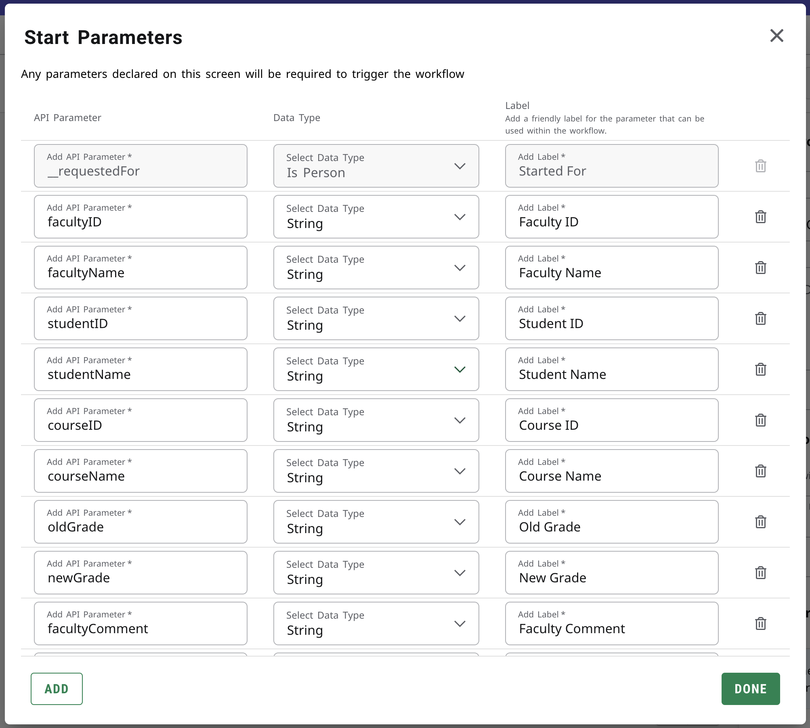
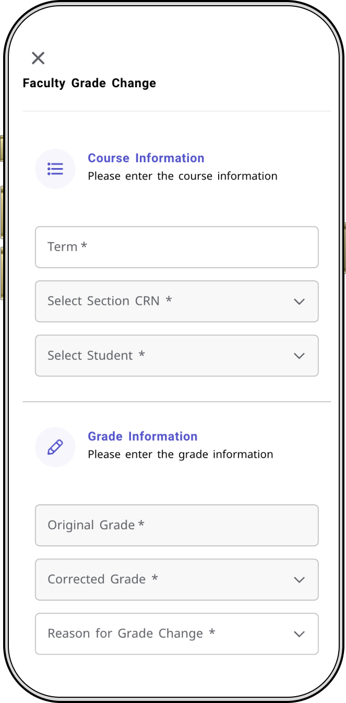
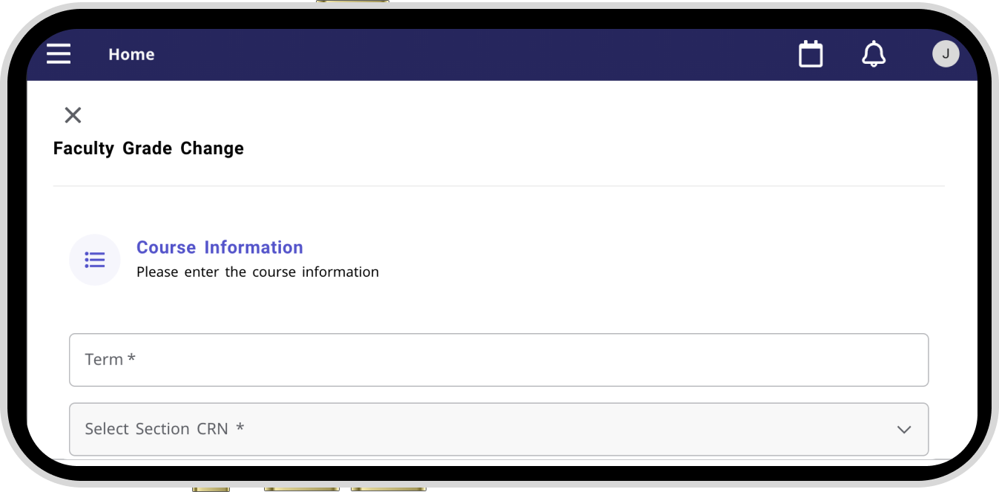

# Experience Faculty Grade Change - Maestro Workflow

This extension facilitates a streamlined process for faculty members to formally request the registrar's intervention in grade adjustments for individual students.

It comprises code for a Experience Card and Page along with an associated Maestro workflow designed to facilitate grade changes by faculty members. 

- The Experience Card and Page enables faculty to specify the target course and desired grade adjustments, triggering the invocation of the Maestro workflow. 
- The Maestro workflow, in turn, executes the grade change process using the information provided by the faculty through the Experience Page.


## Faculty Grade Change Form - Experience Card

The experience card features a straightforward hyperlink leading to the Grade Change Form.

<p align="center">
    
</p>


## Faculty Grade Change Form - Experience Page

The Grade Change Form presents a comprehensive array of fields that users are required to complete in order to retrieve pertinent student information for initiating a grade change request.

Upon inputting the term code, the system dynamically populates all associated courses and their corresponding grades. Upon selection of a specific course, the form further populates with the details of all students enrolled in the chosen term and course. Subsequently, upon choosing a particular student, the form automatically populates their current grade, streamlining the process for users.

<p align="center">
    
</p>

##### JSON Body

The following JSON body is what we'll be submitting to Maestro Workflow API ie, `workflow-instances` API. We have to configure the below mentioned API parameters under the `variables` key on Maestro Start section. 

Please refer the **Start Parameters** image under the Maestro Workflow section.

```JSON
    {
        "id": "f07c9938-69c0-46b1-8db7-dc029b7a204e", // workflow ID
        "variables": {
            "term": {
                "value": "2024/SP"
            },
            "facultyID": {
                "value": "A00042621"
            },
            "facultyName": {
                "value": "Andrew"
            },
            "studentId": {
                "value": "c4ba9260-7fdb-4cf8-9a72-34c132897af7"
            },
            "studentName": {
                "value": "Frank Gehring"
            },
            "sectionId": {
                "value": "19226edc-93b7-4e9a-987c-cbd3c7e0debd"
            },
            "sectionCode": {
                "value": "WMG-100-01"
            },
            "oldGrade": {
                "value": "B"
            },
            "newGrade": {
                "value": "A"
            },
            "facultyComment": {
                "value": "Testing"
            },
            "schemeId": {
                "value": "64fef697-8a89-4cb0-9f64-c7e9089d6b34"  // Internal Use
            },
            "gradeId": {
                "value": "e2404374-e15a-444f-8fd8-7e7aed39d431" // Internal Use
            },
            "academicPeriodId": {
                "value": "5fd7ba09-4c07-440c-847b-6fde566b0d84" // Internal Use
            },
            "gradeChangeCode": {
                "value": "41d913fe-a9c9-4404-8e9c-53bdbb7caf03" // Internal Use
            },
            "gradeRowId": {
                "value": "384dca8d-d7aa-49c8-b394-0a1493abc379" // Internal Use
            }
        }
    }
```

The fields which aren't marked as `Internal Use` would be shown to the registrar during grade change approval screen.


## Maestro Workflow

<p align="center">
    
</p>

#### Start Parameters

Under the start section, we have configure all the above mentioned API variables under start parameters as follows.

<p align="center">
    
</p>

## APIs

This extension necessitated the utilization of EEDM APIs. The following is a compilation of the APIs employed in this context

| Endpoint              | Banner                                                                                                             | Colleague             |
|-----------------------|--------------------------------------------------------------------------------------------------------------------|-----------------------|
| academic-periods | https://resources.elluciancloud.com/bundle/banner_api_ethos_api_academic_periods_16.1.0/page/academic-periods.html | https://resources.elluciancloud.com/bundle/colleague_api_ethos_api_academic_periods_16.1.0/page/academic-periods.html |
| grade-change-reasons | https://resources.elluciancloud.com/bundle/banner_api_ethos_api_grade_change_reasons_6.0.0/page/grade-change-reasons.html                                                                                                                   |https://resources.elluciancloud.com/bundle/colleague_api_ethos_api_grade_change_reasons_6.0.0/page/grade-change-reasons.html|
| sections | https://resources.elluciancloud.com/bundle/banner_api_ethos_api_sections_16.1.0/page/sections.html | https://resources.elluciancloud.com/bundle/colleague_api_ethos_api_sections_16.1.0/page/sections.html |
| section-registrations | https://resources.elluciancloud.com/bundle/banner_api_erp_api_section_registrations_1.0.0/page/section-registrations.html | https://resources.elluciancloud.com/bundle/colleague_api_ethos_api_section_registrations_16.1.0/page/section-registrations.html |
| persons | https://resources.elluciancloud.com/bundle/banner_api_ethos_api_persons_12.6.0/page/persons.html | https://resources.elluciancloud.com/bundle/colleague_api_ethos_api_persons_12.6.0/page/persons.html |
| student-transcript-grades | https://resources.elluciancloud.com/bundle/banner_api_ethos_api_student_transcript_grades_1.1.0/page/student-transcript-grades.html | https://resources.elluciancloud.com/bundle/colleague_api_ethos_api_student_transcript_grades_1.1.0/page/student-transcript-grades.html |
| grade-definitions | https://resources.elluciancloud.com/bundle/banner_api_ethos_api_grade_definitions_6.0.0/page/grade-definitions.html | https://resources.elluciancloud.com/bundle/colleague_api_ethos_api_grade_definitions_6.0.0/page/grade-definitions.html |
| student-transcript-grades-adjustments | https://resources.elluciancloud.com/bundle/banner_api_ethos_api_student_transcript_grades_adjustments_1.0.0/page/student-transcript-grades-adjustments.html | https://resources.elluciancloud.com/bundle/colleague_api_ethos_api_student_transcript_grades_adjustments_1.0.0/page/student-transcript-grades-adjustments.html |

- [workflow-instances (Maestro Workflow API)](https://resources.elluciancloud.com/bundle/services_maestro_api_api_workflow_instances_1.0.0/page/workflow-instances.html)


### DataConnect Serverless APIs & Authorization

It is imperative to generate Dataconnect Serverless APIs for all previously specified APIs, excluding the `workflow-instances`. Specifically, the `student-transcript-grades-adjustments` API will utilize the `Ethos Token` Authentication type, while all other APIs will employ the `User Token` authentication method.

Kindly check the below documentation links for creating Serverless APIs and setting up authorizations permissions for the above mentioned authentication methods
- [DataConnect Serverless APIs](https://resources.elluciancloud.com/bundle/ethos_data_connect_int_design_acn_use/page/t_dc_designer_create_serverless_api.html)
- [Ethos Token](https://resources.elluciancloud.com/bundle/ethos_data_connect_int_design_acn_use/page/t_dc_designer_ethos_token_configuration.html)
- [User Token](https://resources.elluciancloud.com/bundle/ethos_data_connect_int_design_acn_use/page/t_dc_designer_user_token_configuration.html)

For the documentation on `workflow-instances`, kindly refer [here](https://resources.elluciancloud.com/bundle/services_maestro_api_api_workflow_instances_1.0.0/page/workflow-instances.html).

## Experience Page - Flow

The sequence of data flow is as follows

### Independent APIs

Below mentioned APIs are fired as soon as the page is loaded

| Endpoint    | API Type | Description |
| ------------------------------------------------------- |-------------| ------- |
| `academic-periods`  | EEDM | Retrieves the list of term codes available    |
| `grade-change-reasons`    | EEDM | Retrieves the catalogue of reasons available for faculty members to designate when submitting a request for a grade change    |

### Dependent APIs

As soon as the faculty keys in the term code the following data flow gets invoked

| Endpoint    | API Type | Description | Dependent On | Data to Pick | Authentication Type |
| -------- | ------- |--------------|-------------------|-------------------|--------------|
| `sections`  | EEDM | Upon the faculty's input of the term code, this API will be utilized to retrieve a comprehensive list of all available sections associated with the specified term.   | <ul><li>`academicPeriodId`</li></ul> | <ul><li>`id`</li><li>`code`</li><li>`gradeSchemes[0].id`</li></ul> | User Token |
| `section-registrations`  | EEDM | Now based on the section ID we can gather information on all actively enrolled students.    | <ul><li>`sectionId`</li></ul> |<ul><li>`registrant.id`</li></ul> |User Token |
| `student-transcript-grades`  | EEDM | To obtain the current grade of a student, utilize this API by providing the current academic period GUID and the student GUID as necessary parameters.    | <ul><li>`studentGUID`</li><li>`academicPeriodGUID`</li></ul> | <ul><li>`id`</li></ul> |User Token |
| `grade-definitions`  | EEDM | To fetch the list of all accepted grade, this API needs to be called and can be filtered out based on the gradeScheme we retrived from sections API   | <ul><li>`schemeId`</li></ul> | <ul><li>`id`</li><li>`grade.value`</li></ul> |User Token |

Upon acquiring all essential data for the Maestro workflow, proceed to invoke the `workflow-instances` Maestro API along with the workflow ID.


### Maestro Workflow Action

| DataConnect Serverless Endpoint    | API Type | Description | Required Params  | Authentication Type |
| -------- | --------------|------- |--------------|--------------|
| `student-transcript-grades/{id}`  | EEDM | When the registrar approves the grade change, then this API is invoked automatically via Maestro Action and updates the grade.   | <ul><li>`recordId`</li><li>`gradeId`</li><li>`changeReasonId`</li></ul> |Ethos Token |


## Path Design System

For this extension, we have leveraged the following Path Design components to create a clean and minimal UI.

- Grid
- DropdownTypehead
- Snackbar
- TextField
- Button

With Path Design System, you get to experience unparalleled cross-device compatibility, as this extension effortlessly adapts and shines with responsive design.

## Technologies

#### Dataconnect Serverless APIs

As the Faculty Grade Change experience is exclusively accessible to users with the Faculty role, direct utilization of authenticatedEthosFetch is not feasible, given that the majority of APIs are restricted to the experience-admin role. Consequently, we have developed all aforementioned APIs on Data Connect as serverless APIs, with the exception of the `workflow-instances` API.

## Grids

With the Path Design system's grids, our UI seamlessly adapts to whichever screen the user is viewing and provides a flawless user experience.

<p align="center">
    
</p>
<p align="center">
    
</p>


Copyright 2021–2023 Ellucian Company L.P. and its affiliates.


